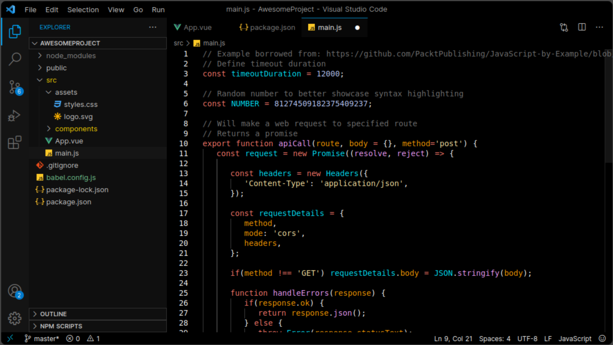

# Just a black theme for Visual Studio Code

## Screenshot



## Installation

### Cloning the Repository

Change to your Visual Studio Code extensions directory:

```bash
# Windows
$ cd %USERPROFILE%\.vscode\extensions

# Linux & macOS
$ cd ~/.vscode/extensions/
```

Clone the repository

```bash
$ git clone https://github.com/JohanAOstbye/vscode-theme JohanAugustOestbye.Just-a-black-theme
```

Now you can select this theme from the Theme selector in VSC

## License

This work is licensed under the MIT license
